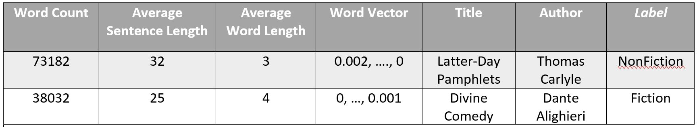

# Project Gutenberg Book Genre Classifier

This project leverages a variety of machine learning algorithms to classify hundreds of Project Gutenberg book texts by genre.

The model is written in Python and uses the Natural Language Toolkit (nltk) for natural language processing (stopword removal, tokenization, setting up the bag-of-words approach, etc). We then use Skikit-Learn coupled with Numpy and Pandas, training and testing on five models: multi-layer perceptron, a modified clustering algorithm, a decision tree, logistic regression, and a random forest.

After rigorous testing, the random forest ensemble consistently achieved the highest accuracy at slightly over 80%. For extensive technical details, view our [research report](doc/ResearchProject.pdf)

## Feature Selection with Examples

## Selected Results

